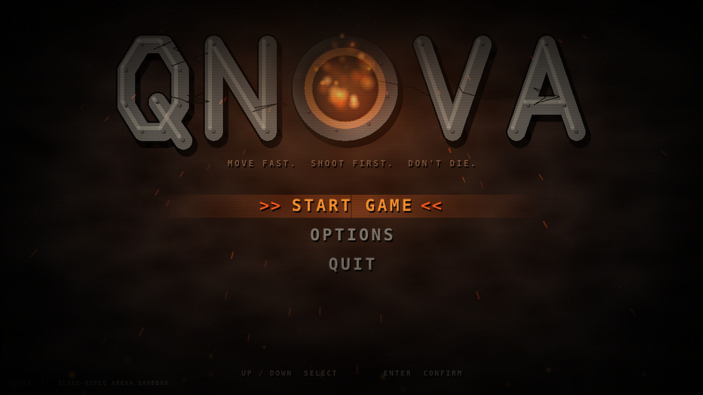

# qnova



A small C# Quake clone focused on Quake 1 movement and weapons.

- `src/Qnova.Core` – headless simulation (no graphics): swept-AABB collision, Quake ground/air movement
  (friction, accelerate, air-strafe/strafe-jumping, step-up, no-autohop jump), weapons and splash damage.
- `src/Qnova.Game` – Raylib-cs 3D frontend with a test arena and target dummies.
- `tests/Qnova.Tests` – xunit tests for movement and weapons.

```
dotnet test
dotnet run --project src/Qnova.Game
```

Controls: WASD, Space (jump, release between hops), mouse look, LMB fire, 1-7 or wheel to change weapon, M mute, R reset, ` (~) opens the console.

Weapons (Q1 stats): Axe, Shotgun (6x4), Double Shotgun (14x4), Nailgun (9), Super Nailgun (18),
Grenade Launcher (bouncing, 2.5s fuse), Rocket Launcher (100-120 direct, 120 splash, self-damage halved,
knockback = damage x 8 so rocket jumps work).

Sound: all effects (weapon fire, grenade bounce, dry-fire click, explosions) are synthesized in code by
`SoundSynth` in `Qnova.Core`, so there are no audio assets to ship. Volume falls off with distance.

## Console

Press `~` to drop the console (game pauses; Esc or `~` closes it). Type a cvar name to see it, `name value`
to set it; `;` separates commands; TAB completes; Up/Down recall history; PgUp/PgDn scroll.

- `help [name]`, `cvarlist [prefix]`, `cmdlist`, `find <text>`, `set`, `toggle`, `reset <cvar>|all`, `echo`, `clear`, `quit`
- Movement cvars: `sv_gravity`, `sv_maxspeed`, `sv_accelerate`, `sv_airaccelerate`, `sv_aircap`, `sv_friction`,
  `sv_stopspeed`, `sv_jumpspeed`, `sv_stepheight`, `sv_autohop`. Client: `sensitivity`, `fov`, `volume`.
- Gameplay commands: `weapon <1-7|name>`, `getpos`, `stats`, `respawn`, `kill`, `mute`.
- Cheats (need `sv_cheats 1`; turning it back off reverts them): `god`, `noclip`, `sv_infiniteammo`,
  `give <all|health|ammo|shells|nails|rockets|weapon> [n]`, `setpos x y z`, `spawn [n]`, `killtargets`, `host_timescale`.

## Map and bots

The arena (`Arena.Build`) is 4096 x 4096 units: a central mesa with stairs on all four sides, four walled
bunkers with doorways, a ring of pillars, an east ledge, crates you can jump onto and cover walls.
One bot spawns at start. Bots use the same movement, weapons and damage rules as you (they obey `sv_gravity` etc.):
they see you by line of sight, hunt your last known position, strafe and hop in a fight, lead projectile shots and
aim rockets at your feet, and pick a weapon by range. Both sides respawn after 3 seconds at the spawn point
farthest from the enemy. The scoreboard (top right) shows frags / deaths; suicide costs a frag.

- `bot_add [n]`, `bot_removeall`, `bots` (scoreboard), `bot_skill 1-5` (aim error, reaction time, turn speed, shot delay), `bot_ai 0|1` (freeze bots)

## Pickups

Health (+25), shells, nails and rockets boxes, and a floor weapon for each gun. You start with only the axe and
shotgun and lose extra guns when you die. Weapons: double shotgun on the central mesa, nailgun / super nailgun /
grenade launcher in the bunkers, rocket launcher on the east ledge. A collected item is gone for **30 seconds**
(`sv_pickup_respawn`), then respawns with a sound. Items you can't use (full health, full ammo) stay put; ammo caps at
100 shells / 200 nails / 100 rockets. Bots collect items too and head for health when hurt. `pickups` lists what's ready.

## Splash screen and menu

The game opens on a dark, gritty splash: **QNOVA** in riveted steel with a furnace burning in the O that detonates every
few seconds (fireball, sparks, smoke, shockwave, screen shake). Everything is drawn procedurally, with no image assets.

- **START GAME / OPTIONS / QUIT** — arrows or W/S to move, Enter to confirm, mouse hover/click also works.
- **OPTIONS** — mouse sensitivity, field of view, volume, bot skill, number of bots (0-4), auto bunny-hop, zoom FOV, plain blocks (flat untextured rendering; also `r_plain 1` in the console), key bindings. Left/Right adjust; Esc goes back.
- **Esc in game** opens the same screen as a pause menu (START becomes RESUME GAME); Esc again resumes.

Menu logic lives in `Qnova.Core/Menu.cs` (unit-tested); drawing is in `Qnova.Game/Splash.cs`.

### Developer flags

Handy for headless screenshots (e.g. under `xvfb-run` with `LIBGL_ALWAYS_SOFTWARE=1`): `--start` (skip the menu), `--paused`,
`--options`, `--console`, `--exec "<console line>"`, `--shot <name.png> --shot-after <seconds>` (saved in the working directory, then exit).

## Map look

The arena is lit by a custom shader (`Qnova.Game/MapRenderer.cs`) with no image assets: procedural stone-slab floors,
concrete-block walls, bolted metal plates and dark ceiling plating, all grimed and cracked, plus point lights
(torches, ceiling lamps, cold bunker lamps, flickering red beacons), dynamic lights for rockets, explosions and muzzle flashes,
and dark distance fog. Map data (surfaces, lights, girders/trim/fixtures) lives in `Qnova.Core` (`MapVisuals.cs`, `Arena.cs`).

## Key bindings

Options > **KEY BINDINGS** lists every action (move, jump, fire, each weapon, next/previous weapon, mute, respawn). Press Enter on
a row, then press the new key, mouse button or wheel notch. Esc cancels, Backspace/Delete unbinds. Binding a key that is already
in use takes it from its old action (the menu tells you). Esc and ` (console) are fixed. "Reset to defaults" restores the originals.

Bindings are saved to `bindings.cfg` in your config folder (`~/.config/qnova` on Linux, `%APPDATA%\qnova` on Windows; override with
`QNOVA_CONFIG_DIR`). Console equivalents: `bind <key> <action>`, `unbind <key|action>`, `unbindall`, `bind_reset`, `bindlist`.
Key names are the upper-case Raylib names (`W`, `SPACE`, `LEFTSHIFT`, `UP`, `ONE`...) plus `MOUSE1`-`MOUSE5`, `MWHEELUP`, `MWHEELDOWN`.
Actions: forward back moveleft moveright jump attack weapon1-weapon7 nextweapon prevweapon mute respawn.
Dev flags: `--no-config` (ignore the saved file), `--keybinds [--capture]` (open the bindings screen).

## Zoom, kill messages and cheats

- **Zoom**: hold **MOUSE3** (middle button; rebindable, action `zoom`) to ease into a narrower view; look speed scales with the view so aiming stays precise.
  Set the magnification with Options > ZOOM FOV or `zoom_fov` (default 30; smaller = more zoom).
- **Kill messages** name the weapon: `Bot1 killed You with the Rocket Launcher`, `You killed Bot1 with the Double Shotgun`,
  and a self-kill reads `You suicided (Rocket Launcher)`.
- **Cheats** (need `sv_cheats 1`): `giveall` (every weapon + full ammo, health untouched), `impulse 9` (same, Quake-style),
  and the existing `give all` (everything *and* full health).
